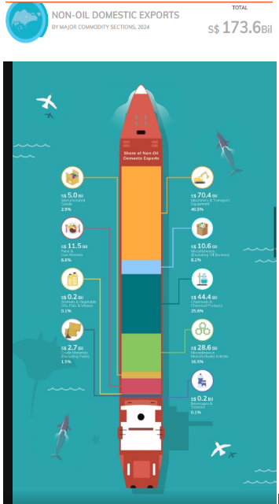
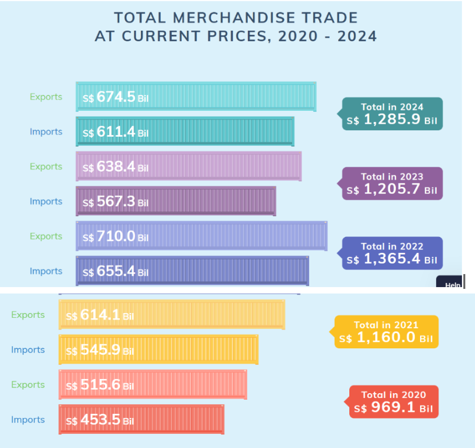
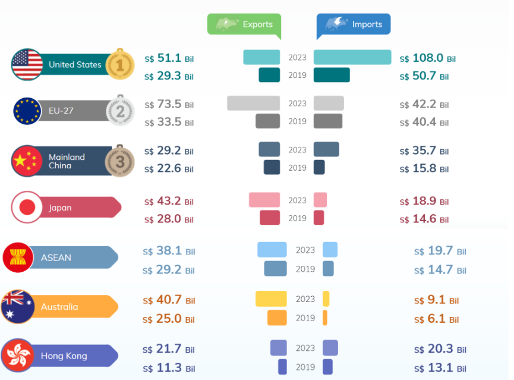

# DataVis Makeover and time series analysis: Singapore's International Trade

# 1. Introduction

## 1.1 Background

## 1.2 Objective and Tasks

Select 3 data visualisation from this [report page](https://www.singstat.gov.sg/modules/infographics/singapore-international-tradec)from Statistics Singapore\
comments on the pros and cons and provide sketches of the make-over

# 2. Getting Started

::: panel-tabset
## Installing Libraries

```{r}
pacman::p_load(ggplot2,dplyr,patchwork,tidyverse,tidymodels,ggdist,ggridges, ggthemes,colorspace,scales,ggiraph,ggstatsplot,scales,crosstalk,plotly,CGPfunctions,tsibble, feasts, fable, seasonal,readxl)
```

```{r}
Sys.setlocale("LC_TIME", "C")  
```

## Importing Data

The data used in this report is  [Merchandise Trade by Region/Market](https://www.singstat.gov.sg/find-data/search-by-theme/trade-and-investment/merchandise-trade/latest-data) from [Department of Statistics Singapore, DOS](https://www.singstat.gov.sg/).

outputFile (2) is the Merchandise Trade data and outputFile (3) is the Trade in Services (TIS) data.

```{r}
file_path <- "data/outputFile (2).xlsx"
file_path2 <- "data/outputFile (3).xlsx"

```
:::

# 3. Data Visualisation Makeover

## 3.1 Non-oil Domestic Export and Re-Exports 2024

### 3.1.1 Original Visualisation



::: callout-note
## Observation

Procs:

-   **Dynamic presentation**: The graph uses an engaging and visually appealing layout.
-   **Clear category labels**: The text for each category is easy to read, and the accompanying icons help with quick comprehension.

Concs:

-   **Overly colorful**: The vibrant design can be distracting, making it hard to focus on the stacked bar chart in the center of the ship.

-   **Prioritization of text elements**: In the stack barchart , the percentage share are more important than the exact monetary values. However, the design emphasizes the dollar amounts instead.

-   **Stacked bar ordering**: If the segments were arranged in descending order based on percentage share, it would be easier to compare and interpret the data at a glance.
:::

In the further step, I will:

-   Increase the font size of the percentage values to highlight the relative proportions of each category.

-   Arrange the order by the value.

-   Combine it with the Re-exported data. You can take a look of the difference in distribution.

-   Add the value number in the tooltip

::: panel-tabset
## Selecting Data

Select the non-oil data we want. As for the time, only select the data in 2024.

```{r}

Non_oil_exp <- read_excel(file_path, sheet = 2, skip = 10, col_names = TRUE)
Non_oil_exp<- Non_oil_exp[46:55, ]
Non_oil_exp <- Non_oil_exp[c(1, 3:14)]
rownames(Non_oil_exp) <- Non_oil_exp[[1]]

Non_oil_exp2024 <- Non_oil_exp %>%
  mutate(`2024` = rowSums(select(., starts_with("2024")), na.rm = TRUE))

#re-export
Non_oil_rexp <- read_excel(file_path, sheet = 2, skip = 10, col_names = TRUE)
Non_oil_rexp<- Non_oil_rexp[59:68, ]
Non_oil_rexp <- Non_oil_rexp[, c(1, 3:14)]
rownames(Non_oil_rexp) <- Non_oil_rexp[[1]]

Non_oil_rexp2024 <- Non_oil_rexp %>%
  mutate(`2024` = rowSums(select(., starts_with("2024")), na.rm = TRUE))
```

## Calculate the percentage

Combine all the 2024 month value data into a total year value in 2024. Calculate the percentage of each type of the product.

```{r}
total_non_oil <- Non_oil_exp2024 %>%
  filter(`Data Series` == "Non-Oil") %>%
  pull(`2024`)  

Non_oil_exp2024_stack <- Non_oil_exp2024 %>%
  filter(`Data Series` != "Non-Oil") %>%
  mutate(Value_Billion = round(`2024` / 1e6)) %>%  #convert to Billion
  mutate(Percent = (`2024` / total_non_oil) * 100) %>%
  mutate(`Data Series` = fct_reorder(`Data Series`, Percent, .desc = TRUE))
```

```{r}
total_non_oil_re <- Non_oil_rexp2024 %>%
  filter(`Data Series` == "Non-Oil") %>%
  pull(`2024`)  # get the 2024 totla value

Non_oil_rexp2024_stack <- Non_oil_rexp2024 %>%
  filter(`Data Series` != "Non-Oil") %>%
  mutate(Value_Billion = round(`2024` / 1e6)) %>%  # 轉換為 Billion
  mutate(Percent = (`2024` / total_non_oil_re) * 100) %>%
  mutate(`Data Series` = fct_reorder(`Data Series`, Percent, .desc = TRUE))
```
:::

### 3.1.2 Make-over Visualisation

::: panel-tabset
## The plot

```{r}
#| echo: false

non_oil_colors <- c(
    "Food & Live Animals"= "blue",
    "Beverages & Tobacco" = "#1f77b4",
    "Crude Materials (Excl Fuels)" = "#d62728",
    "Animal & Vegetable Oils Fats & Waxes" = "#2ca02c",
    "Chemicals & Chemical Products" = "#9467bd",
    "Manufactured Goods" = "#17becf",
    "Machinery & Transport Equipment" = "#ff7f0e",
    "Miscellaneous Manufactured Articles" = "#7f7f7f",
    "Miscellaneous (Excluding Oil Bunkers)" = "#8c564b"
  )


total_domestic_exports <- format(sum(Non_oil_exp2024_stack$Value_Billion), big.mark = ",")
total_re_exports <- format(sum(Non_oil_rexp2024_stack$Value_Billion), big.mark = ",")


p1 <- ggplot(Non_oil_exp2024_stack, aes(
    x = "DOMESTIC EXPORTS", y = Percent, fill = `Data Series`,
    text = paste0("<b>", `Data Series`, "</b><br>Value: $", Value_Billion, " Billion")
  )) +
  geom_bar(stat = "identity", width = 0.6) +
  geom_text(aes(label = ifelse(Percent > 2.8, paste0(round(Percent, 1), "%"), "")),  
          position = position_stack(vjust = 0.5), size = 3.5, color = "black")  +  
  geom_text(aes(y = -9, label = paste0("($", total_domestic_exports, " Billion)")),  
            size = 3, color = "black") + 
  labs(x = "", y = "Percentage") +
  guides(fill = "none") +
  theme_minimal() +
  theme(
    plot.title = element_text(hjust = 0.5, size = 14, face = "bold"),  
    axis.title.x = element_text(size = 10),  
    axis.title.y = element_text(size = 10),  
    axis.text.x = element_text(size = 10),  
    axis.text.y = element_text(size = 10)
  ) +
  scale_fill_manual(values = non_oil_colors)

p1_interactive <- ggplotly(p1,tooltip = "text") %>%
  layout(showlegend = FALSE)

# ✅ `p2` (RE-EXPORTS)
p2 <- ggplot(Non_oil_rexp2024_stack, aes(x = "RE-EXPORTS", y = Percent, fill = `Data Series`,text = paste0("<b>", `Data Series`, "</b><br>Value: $", Value_Billion, " Billion")
  )) +
  geom_bar(stat = "identity", width = 0.6) +
   geom_text(aes(label = ifelse(Percent > 3, paste0(round(Percent, 1), "%"), "")),  
          position = position_stack(vjust = 0.5), size = 3.5, color = "black") + 
  geom_text(aes(y =-9, label = paste0("($", total_re_exports, " Billion)")),  
            size = 3, color = "black") + 
  labs(x = "", y = "", fill = "Non-Oil Product",title = "Composition of NON-OIL DOMESTIC and RE-EXPORTS in 2024") +  
  theme_minimal() +
  theme(
    axis.title.x = element_text(size = 10),  
    axis.text.x = element_text(size = 10),  
    axis.text.y = element_blank(),  
    axis.ticks.y = element_blank() 
  ) +
  scale_fill_manual(values = non_oil_colors)

p2_interactive <- ggplotly(p2,tooltip = "text")


combined_plot <- subplot(p1_interactive, p2_interactive, nrows = 1, shareY = TRUE) %>%
  layout(
    xaxis = list(title = ""),  
    yaxis = list(title = "Percentage"),font = list(size = 10)
  )

combined_plot
```

## The code

```{r,eval=FALSE}
non_oil_colors <- c(
    "Food & Live Animals"= "blue",
    "Beverages & Tobacco" = "#1f77b4",
    "Crude Materials (Excl Fuels)" = "#d62728",
    "Animal & Vegetable Oils Fats & Waxes" = "#2ca02c",
    "Chemicals & Chemical Products" = "#9467bd",
    "Manufactured Goods" = "#17becf",
    "Machinery & Transport Equipment" = "#ff7f0e",
    "Miscellaneous Manufactured Articles" = "#7f7f7f",
    "Miscellaneous (Excluding Oil Bunkers)" = "#8c564b"
  )


total_domestic_exports <- format(sum(Non_oil_exp2024_stack$Value_Billion), big.mark = ",")
total_re_exports <- format(sum(Non_oil_rexp2024_stack$Value_Billion), big.mark = ",")


p1 <- ggplot(Non_oil_exp2024_stack, aes(
    x = "DOMESTIC EXPORTS", y = Percent, fill = `Data Series`,
    text = paste0("<b>", `Data Series`, "</b><br>Value: $", Value_Billion, " Billion")
  )) +
  geom_bar(stat = "identity", width = 0.6) +
  geom_text(aes(label = ifelse(Percent > 2.8, paste0(round(Percent, 1), "%"), "")),  
          position = position_stack(vjust = 0.5), size = 3.5, color = "black")  +  
  geom_text(aes(y = -9, label = paste0("($", total_domestic_exports, " Billion)")),  
            size = 3, color = "black") + 
  labs(x = "", y = "Percentage") +
  guides(fill = "none") +
  theme_minimal() +
  theme(
    plot.title = element_text(hjust = 0.5, size = 14, face = "bold"),  
    axis.title.x = element_text(size = 10),  
    axis.title.y = element_text(size = 10),  
    axis.text.x = element_text(size = 10),  
    axis.text.y = element_text(size = 10)
  ) +
  scale_fill_manual(values = non_oil_colors)

p1_interactive <- ggplotly(p1,tooltip = "text") %>%
  layout(showlegend = FALSE)

# ✅ `p2` (RE-EXPORTS)
p2 <- ggplot(Non_oil_rexp2024_stack, aes(x = "RE-EXPORTS", y = Percent, fill = `Data Series`,text = paste0("<b>", `Data Series`, "</b><br>Value: $", Value_Billion, " Billion")
  )) +
  geom_bar(stat = "identity", width = 0.6) +
   geom_text(aes(label = ifelse(Percent > 3, paste0(round(Percent, 1), "%"), "")),  
          position = position_stack(vjust = 0.5), size = 3.5, color = "black") + 
  geom_text(aes(y =-9, label = paste0("($", total_re_exports, " Billion)")),  
            size = 3, color = "black") + 
  labs(x = "", y = "", fill = "Non-Oil Product",title = "Composition of NON-OIL DOMESTIC and RE-EXPORTS in 2024") +  
  theme_minimal() +
  theme(
    axis.title.x = element_text(size = 10),  
    axis.text.x = element_text(size = 10),  
    axis.text.y = element_blank(),  
    axis.ticks.y = element_blank() 
  ) +
  scale_fill_manual(values = non_oil_colors)

p2_interactive <- ggplotly(p2,tooltip = "text")


combined_plot <- subplot(p1_interactive, p2_interactive, nrows = 1, shareY = TRUE) %>%
  layout(
    xaxis = list(title = ""),  
    yaxis = list(title = "Percentage"),font = list(size = 10)
  )

combined_plot
```
:::

Hover the mouse to check the tooltip. It is clear to see that Singapore has more re-export value than domestic export value.

-   The amount of re-exports is much higher than domestic exports, which shows Singapore's status as an entrepot trade center.
-   Machinery & Transport Equipment is the main product in both export and re-export commodity, accounting for a high value in Singapore total export.
-   Chemicals & Chemical Products is mainly Singapore's local production, showing the importance of this industry in the domestic economy.

## 3.2 Total Merchandise Trade 2020-2024

### 3.2.1 Original Visualisation

{width="541"}

::: callout-note
## Observation

Procs:

-   **Visually engaging:** The use of different colors and container graphics makes the visualization attractive.
-   **Clear numerical representation:** Export and import figures are clearly displayed, making it easy to compare across years.

Concs:

-   **Overly colorful and distracting:** The wide variety of colors creates visual clutter, making it harder to focus on key insights.
-   **Lack of clear differentiation between exports and imports:** The data for "Exports" and "Imports" do not have a strong visual hierarchy, making the overall information feel overwhelming.
:::

In the further step, I will:

-   Optimize color usage – Assign same colors for "Exports" and "Imports" across all years to make classification more intuitive.
-   Emphasize trend changes – Incorporate an additional trend line to highlight the overall movement of total trade across years.
-   Include a trade balance trend line – Show the trade surplus/deficit over time for better economic insights
-   Add a legend for exports and imports – Ensure that readers can quickly differentiate between the two without confusion.

::: panel-tabset
## Selecting Data

Select the merchandise trade data (total, Import, Export)from 2020-2024 and combine the data in same year. New column 2020,2021,2022,2023,2024 are created.

```{r}
total_trade <- read_excel(file_path, sheet = 2, skip = 10, col_names = TRUE)
total_trade <- total_trade[c(1,15,28), ]
total_trade <- total_trade[c(1, 3:62)]
rownames(total_trade) <- total_trade[[1]]

total_trade_year <- total_trade %>%
  mutate(
    `2024` = rowSums(select(., starts_with("2024")), na.rm = TRUE),
    `2023` = rowSums(select(., starts_with("2023")), na.rm = TRUE),
    `2022` = rowSums(select(., starts_with("2022")), na.rm = TRUE),
    `2021` = rowSums(select(., starts_with("2021")), na.rm = TRUE),
    `2020` = rowSums(select(., starts_with("2020")), na.rm = TRUE)
  )

```

## Convert into Long format

Convert the data into long format in order to do the further visualization.

```{r}
total_trade_long <- total_trade_year %>%
  pivot_longer(cols = -`Data Series`, names_to = "Year", values_to = "Value") %>%
  mutate(Year = as.character(Year))

filtered_trade <- total_trade_long %>%
  filter(
    Year %in% c("2020", "2021", "2022", "2023", "2024"),
    `Data Series` %in% c("Total Merchandise Imports, (At Current Prices)", 
                          "Total Merchandise Exports, (At Current Prices)")
  )


trade_total <- total_trade_long %>%
  filter(
    Year %in% c("2020", "2021", "2022", "2023", "2024"),
    `Data Series` == "Total Merchandise Trade, (At Current Prices)"
  ) %>%
  select(Year, Trade_Value = Value)  
```
:::

### **3.2.2 Make-over Visualisation**

::: panel-tabset
## The plot

```{r}
#| echo: false
#| fig-height: 6
#| fig-weight: 5
p3 <- ggplot(data = filtered_trade, 
            aes(x = Year, y = Value, fill = `Data Series`)) +
  geom_bar(stat = "identity", position = "dodge") +
  geom_text(aes(label = round(Value / 1e6)), position = position_dodge(width = 0.9), vjust = -0.5,size = 3)  +

  labs(title = "Total Merchandise Imports and Exports",
       x = "Year",
       y = "Value (S$ Billion)",
       fill = "Trade Type") +
  
  theme_minimal() +
  theme(legend.position = "top",legend.title = element_blank(),
    plot.title = element_text(hjust = 0) 
  ) +
  scale_y_continuous(labels = function(x) paste0(round(x / 1e6, 1))) + 
  scale_fill_manual(
    values = c("#4E79A7","#E15759"), 
    labels = c("Exports", "Imports")  
  )


p4 <- ggplot(data = trade_total, aes(x = Year, y = Trade_Value, group = 1)) +
  geom_line(color = "black", size = 1.2, linetype = "solid")+
  labs(title = "Total Merchandise Trade 2020-2024",
       x = "Year",
       y = "Value (S$ Billion)",
       fill = "Trade Type") + 
  geom_point(data = trade_total, aes(x = Year, y = Trade_Value), color = "black", size = 2)+
  geom_text(aes(label = round(Trade_Value / 1e6)), position = position_dodge(width =1), vjust = 0.8,hjust = 1) +
theme_minimal() + theme(
    plot.title = element_text(size = 12) +
  scale_y_continuous(labels = function(x) paste0(round(x / 1e6))))


trade_surplus <- filtered_trade %>%
  pivot_wider(names_from = `Data Series`, values_from = Value) %>%
  mutate(Trade_Surplus = `Total Merchandise Exports, (At Current Prices)` - 
                         `Total Merchandise Imports, (At Current Prices)`) %>%
  select(Year, Trade_Surplus)


p5 <- ggplot(data = trade_surplus, aes(x = Year, y = Trade_Surplus, group = 1)) +
  
  geom_line(color = "lightgreen", size = 1.2, linetype = "solid") +  
  geom_point(color = "lightgreen", size = 2) +  
  geom_text(aes(label = round(Trade_Surplus / 1e6)), vjust = 0.8, hjust = 1.5, color = "black") +  

  labs(title = "Total Merchandise Trade Surplus 2020-2024",
       x = "Year",
       y = "Value (S$ Billion)") + 
  theme_minimal() + theme(
    plot.title = element_text(size = 12) 
  )+
  scale_y_continuous(labels = function(x) paste0(round(x / 1e6)))  

p3+p4/p5

```

## The code

```{r,eval=FALSE}
p3 <- ggplot(data = filtered_trade, 
            aes(x = Year, y = Value, fill = `Data Series`)) +
  geom_bar(stat = "identity", position = "dodge") +
  geom_text(aes(label = round(Value / 1e6)), position = position_dodge(width = 0.9), vjust = -0.5,size = 3)  +

  labs(title = "Total Merchandise Imports and Exports",
       x = "Year",
       y = "Value (S$ Billion)",
       fill = "Trade Type") +
  
  theme_minimal() +
  theme(legend.position = "top",legend.title = element_blank(),
    plot.title = element_text(hjust = 0) 
  ) +
  scale_y_continuous(labels = function(x) paste0(round(x / 1e6, 1))) + 
  scale_fill_manual(
    values = c("#4E79A7","#E15759"), 
    labels = c("Exports", "Imports")  
  )


p4 <- ggplot(data = trade_total, aes(x = Year, y = Trade_Value, group = 1)) +
  geom_line(color = "black", size = 1.2, linetype = "solid")+
  labs(title = "Total Merchandise Trade 2020-2024",
       x = "Year",
       y = "Value (S$ Billion)",
       fill = "Trade Type") + 
  geom_point(data = trade_total, aes(x = Year, y = Trade_Value), color = "black", size = 2)+
  geom_text(aes(label = round(Trade_Value / 1e6)), position = position_dodge(width =1), vjust = 0.8,hjust = 1) +
theme_minimal() + theme(
    plot.title = element_text(size = 12) +
  scale_y_continuous(labels = function(x) paste0(round(x / 1e6))))


trade_surplus <- filtered_trade %>%
  pivot_wider(names_from = `Data Series`, values_from = Value) %>%
  mutate(Trade_Surplus = `Total Merchandise Exports, (At Current Prices)` - 
                         `Total Merchandise Imports, (At Current Prices)`) %>%
  select(Year, Trade_Surplus)


p5 <- ggplot(data = trade_surplus, aes(x = Year, y = Trade_Surplus, group = 1)) +
  
  geom_line(color = "lightgreen", size = 1.2, linetype = "solid") +  
  geom_point(color = "lightgreen", size = 2) +  
  geom_text(aes(label = round(Trade_Surplus / 1e6)), vjust = 0.8, hjust = 1.5, color = "black") +  

  labs(title = "Total Merchandise Trade Surplus 2020-2024",
       x = "Year",
       y = "Value (S$ Billion)") + 
  theme_minimal() + theme(
    plot.title = element_text(size = 12) 
  )+
  scale_y_continuous(labels = function(x) paste0(round(x / 1e6)))  

p3+p4/p5

```
:::

By standardizing the colors for imports and exports, the time-based variations become more visually apparent.

-   In the line charts, it is seen that while 2022 had the highest total trade volume, the trade surplus was at its lowest. This indicates a change of percentage between exports and imports, suggesting that imports increased more significantly in 2022.
-   A decline in total trade in 2023 suggests a possible economic slowdown or global trade disruptions, but the slight recovery in 2024 indicates a rebound.
-   Although the total trade volume decreased in 2023 and 2024, the trade surplus recovered, which may also represent changes in the proportion of imports.

## 3.3 Major trading partners for trade in services 2023

###  3.3.1 Original Visualisation



::: callout-note
## Observation

Procs:

-   **Clear flag and ranking:** The chart marks the national flags of each country, and uses gold, silver, and bronze medals to distinguish the top three, allowing readers to quickly identify major trading partners.

-   The import and export data are displayed side by side for easy comparison:\
    The import and export data of 2023 and 2019 are put together and use different colors, so that people can see changes at a glance and easily observe trends.

-   Visually display the **trade surplus or deficit** of each country:\
    Through side-by-side import and export data, users can easily see whether a country has a trade surplus or deficit.

Cons:

-   There is no exact title.
-   No explanation of the ranking method. Is the ranking based on the total trade volume (total import and export) in 2023, or the data in 2019? Or sort by export amount?
-   If the comparison units are countries, then the EU should not be ranked as a single entity.
-   Missing time trend line. Although two time points in 2019 and 2023 are shown, the time trend is not clearly presented.
:::

In the next step, I will:

-   Focus on ranking based on total trade volume and add a time trend line.
-   Include a title for a plot.
-   Display the total trade amount to clarify the ranking method.

::: panel-tabset
## Selecting Data 

Select the country instead of the union. Choose the year (2019,2023) that I want to compare.

```{r}
file_path2 <- "data/outputFile (3).xlsx"
Exports_partner <- read_excel(file_path2, sheet = 4, skip = 10, col_names = TRUE)
Exports_partner <- Exports_partner[,c(1,2,6)]%>%
  slice(-c(1, 25, 26,45,46,49,54,63))

Imports_partner <- read_excel(file_path2, sheet = 8, skip = 10, col_names = TRUE)
Imports_partner <- Imports_partner[,c(1,2,6)]%>%
  slice(-c(1, 25, 26,45,46,49,54,63))
```

## Covert data into long format

Combine the export and income value together after coverting data into long format.

```{r}
Exports_partner_long <- Exports_partner %>%
  pivot_longer(cols = -`Data Series`, names_to = "Year", values_to = "Value") %>%
  mutate(Year = as.character(Year))

Imports_partner_long <- Imports_partner %>%
  pivot_longer(cols = -`Data Series`, names_to = "Year", values_to = "Value") %>%
  mutate(Year = as.character(Year))

combined_partner <- full_join(Exports_partner_long, Imports_partner_long, 
                            by = c("Year", "Data Series"), 
                            suffix = c("_Exports", "_Imports"))

total_combined_partner <- combined_partner %>%
  mutate(total = Value_Exports + Value_Imports)
```
:::

### **3.3.2 Make-over Visualisation**

::: panel-tabset
## The plot

```{r}
#| echo: false
total_combined_partner_slope <- total_combined_partner %>%
  mutate(Year = factor(Year)) %>%  
  filter(Year %in% c(2023, 2019),   
         !is.na(`Data Series`),      
         `Data Series` != "")%>%  
  newggslopegraph(Year, total,`Data Series`,
                Title = "Major Trading Partners for Trade in Services ",
                SubTitle = "Comparison between 2019 and 2023",
                Caption = "Prepared by: Chen Peng-Wei")+
  theme(
    plot.title = element_text(size = 12, face = "bold"))
total_combined_partner_slope
```

## The code

```{r,eval=FALSE}
total_combined_partner_slope <- total_combined_partner %>%
  mutate(Year = factor(Year)) %>%  
  filter(Year %in% c(2023, 2019),   
         !is.na(`Data Series`),      
         `Data Series` != "")%>%  
  newggslopegraph(Year, total,`Data Series`,
                Title = "Major Trading Partners for Trade in Services ",
                SubTitle = "Comparison between 2019 and 2023",
                Caption = "Prepared by: Chen Peng-Wei")+
  theme(
    plot.title = element_text(size = 12, face = "bold"))
total_combined_partner_slope
```
:::

The slopegragh, Major Trading Partners for Trade in Services, compares trade volumes between 2019 and 2023 for different countries. Countries with steeper slopes indicate faster growth in trade volume, whereas flatter slopes suggest stability or slow growth.

-   United States' Dominance: The United States is by far the largest trading partner in services, with its trade value almost doubling from 2019 to 2023.

-   Mainland China and Japan have maintained high rankings, with steady growth in service trade volumes.

-   Australia, Hong Kong, and Ireland show consistent trade growth in services.

# 4. Time Series Analysis: Merchandise Trade by Commodity Section

```{r}
file_path <- "data/outputFile (2).xlsx"
export_product <- read_excel(file_path, sheet = 2, skip = 10, col_names = TRUE)
export_product <- export_product[c(44,45,47:55), ]
# 只保留 第一欄 和 第 3-14 欄
export_product <- export_product[c(1, 3:122)]

```

```{r}

export_product_long <- export_product %>%
  rename(Product = `Data Series`) %>%  # 🔹 修改欄位名稱
  pivot_longer(cols = -Product, names_to = "Year", values_to = "Value") 

export_product_long <- export_product_long %>%
  mutate(Year = yearmonth(Year))

export_product_long

```

export_product_long \<- export_product %\>% rename(Product = `Data Series`) %\>% \# 🔹 修改欄位名稱 pivot_longer(cols = -Product, names_to = "Year", values_to = "Value") %\>% mutate(Year = as.character(Year)) %\>% mutate(Year = as.Date(paste0("01 ", Year), format = "%d %Y %b")) %\>% mutate(Year = yearmonth(Year))

export_product_long

```{r}

```

```         
```

export_product_long \<- export_product %\>% rename(Product = `Data Series`) %\>% \# 🔹 修改欄位名稱 pivot_longer(cols = -Product, names_to = "Year", values_to = "Value") %\>% mutate(Year = as.character(Year)) %\>% mutate(Year = as.Date(paste0("01 ", Year), format = "%d %Y %b"))

```{r}
library(tsibble)
library(dplyr)


```

export_product_tsibble \<- export_product_long %\>% mutate(Year = yearmonth(as.character(Year)))

```{r}
export_product_tsibble <- export_product_long %>%
  filter(!is.na(Year)) %>%  # 🔹 移除 NA
  mutate(Year = yearmonth(as.character(Year))) 

export_product_tsibble <- export_product_tsibble %>%
  as_tsibble(index = Year, key = Product)

export_product_tsibble

```

```{r}
#| fig-height: 6
#| fig-width: 6

export_product_yearly <- export_product_long %>%
  mutate(Year = format(Year, "%Y")) %>%  # 只保留年份
  group_by(Product, Year) %>%  # 依據 Product 和 Year 分組
  summarise(Value = sum(Value, na.rm = TRUE)) %>%  # 加總 Value
  ungroup() %>%
  mutate(Year = as.character(Year),  # 確保 Year 是 character
         Value = as.numeric(Value))  # 確保 Value 是數值

export_product_yearly_slope <- export_product_yearly %>%
  mutate(Year = factor(Year)) %>%  # 轉換 Year 為 Factor
  filter(Year %in% c(2024, 2015),   # 只篩選 2023 & 2019
         !is.na(`Product`),      # 移除 NA 值
         `Product` != "")%>%  
  newggslopegraph(Year, Value,`Product`,
                Title = "Major Trading Partners for Trade in Services ",
                SubTitle = "Comparison between 2019 and 2023",
                Caption = "Prepared by: Chen Peng-Wei")+
  theme(
    plot.title = element_text(size = 12, face = "bold"))
export_product_yearly_slope 

```

```{r}
export_product_long %>%
  summarise(missing_years = sum(is.na(Year)), missing_products = sum(is.na(Product)))


```

```{r}
#| fig-weight: 30
#| fig-height: 6
ggplot(data = export_product_yearly, 
       aes(x = Year, y = Value, color = Product, group = Product)) +
  geom_line(size = 0.5) +  # 🔹 加上 group 讓線條連接
  geom_point(size = 1) +  # 加上點，確保數據有顯示
  theme_minimal() +
  theme(legend.position = "bottom", 
        legend.box.spacing = unit(0.5, "cm")) +
  labs(title = "Total Export Value (2015-2024)",
       x = "Year",
       y = "Value",
       color = "Product")  # 圖例標題

```

```{r}
export_product_long %>%
  filter(`Product` == "Food & Live Animals") %>%  # 🔹 確保 Data Series 名稱使用反引號
  ggplot(aes(x = Year, y = Value)) +  # 🔹 Year 不需要反引號（如果是數值或日期型）
  geom_line(size = 0.5) 
```

```{r}
#| fig-weight: -50
ggplot(data = export_product_long, 
       aes(x = `Year`, 
           y = Value,
           color = `Product`))+
  geom_line(size = 0.5) +
  theme(legend.position = "bottom", 
        legend.box.spacing = unit(0.5, "cm"))
```

can do the year slopegraph

```{r}
#| fig-height: 6
#| fig-weight: 5
ggplot(data = export_product_long, 
       aes(x = `Year`, 
           y = Value))+
  geom_line(size = 0.5) +
  facet_wrap(~ Product,
             ncol = 3,
             scales = "free_y") +
  theme_bw()
```

Machinery & Transport Equipment/ Chemicals & Chemical Products/Miscellaneous Manufactured Articles/Food & Live Animals\

```{r}
#| fig-height: 8
#| fig-weight: 5
export_product_tsibble %>%
  filter(Product == "Machinery & Transport Equipment" |
         Product == "Chemicals & Chemical Products" )%>% 
  gg_subseries(Value) 
```

```{r}
#| fig-height: 8
#| fig-weight: 5
export_product_tsibble %>%
  filter(Product %in% c("Miscellaneous Manufactured Articles", "Food & Live Animals")) %>%
  gg_subseries(Value)


```

```{r}
#| fig-height: 7
#| fig-weight: 3
export_product_tsibble %>%
  filter(Product %in% c("Machinery & Transport Equipment",
                        "Chemicals & Chemical Products",
                        "Miscellaneous Manufactured Articles",
                        "Food & Live Animals")) %>%
  mutate(Product = factor(Product, levels = c("Machinery & Transport Equipment",
                                              "Chemicals & Chemical Products",
                                              "Miscellaneous Manufactured Articles",
                                              "Food & Live Animals"))) %>%  # 🔹 設定 Product 順序
  ACF(Value) %>%
  autoplot()
```

```{r}
export_product_tsibble %>%
  filter(`Product` == "Food & Live Animals") %>%
  gg_tsdisplay(Value)
```

```{r}
export_product_tsibble  %>%
  filter(`Product` == "Miscellaneous Manufactured Articles") %>%
  model(stl = STL(Value)) %>%
  components() %>%
  autoplot()
```

```{r}
export_product_tsibble  %>%
  filter(`Product` == "Food & Live Animals") %>%
  model(stl = STL(Value)) %>%
  components() %>%
  autoplot()
```

```{r}
export_product_tsibble  %>%
  filter(`Product` == "Machinery & Transport Equipment") %>%
  model(stl = STL(Value)) %>%
  components() %>%
  autoplot()
```

```{r}
export_product_tsibble  %>%
  filter(`Product` == "Chemicals & Chemical Products") %>%
  model(stl = STL(Value)) %>%
  components() %>%
  autoplot()
```
