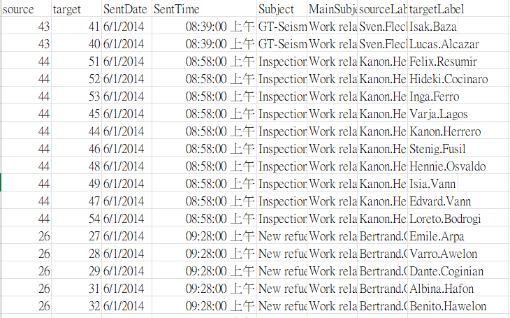
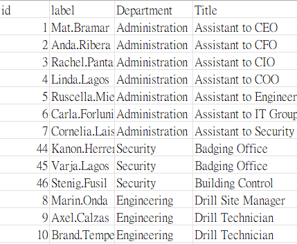
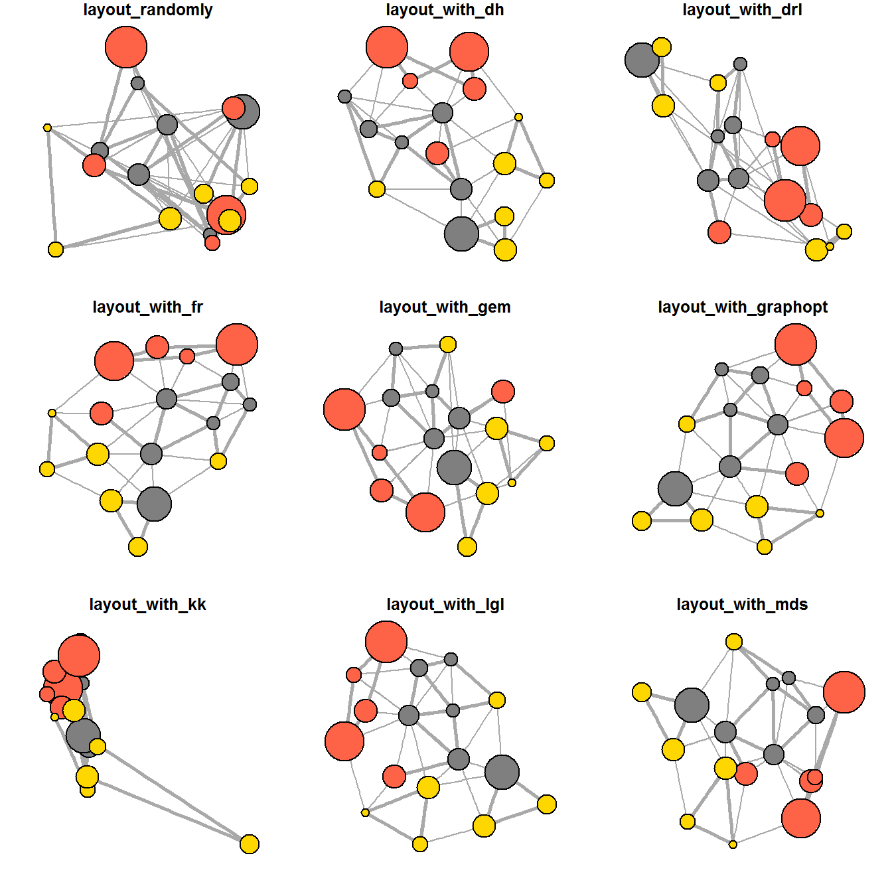

# 1. Overview

# 2. Getting Started

## 2.1 Installing and launching R packages

In this hands-on exercise, we need to download igraph, tidygraph, ggraph and visNetwork.( network data modelling and visualisation packages).

Beside these four packages, tidyverse and [lubridate](https://lubridate.tidyverse.org/), an R package specially designed to handle and wrangling time data will be installed and launched too.\

```{r}
Sys.setlocale("LC_TIME", "C")  
```

```{r}
pacman::p_load(igraph, tidygraph, ggraph, 
               visNetwork, lubridate, clock,
               tidyverse, graphlayouts)
```

# 3. Data Preparation

The data sets used in this hands-on exercise is from an oil exploration and extraction company. There are two data sets. One contains the nodes data and the other contains the edges (also know as link) data.

:::: panel-tabset
## The edges data

-   *GAStech-email_edges.csv* which consists of two weeks of 9063 emails correspondances between 55 employees.\
    

```{r}
GAStech_nodes <- read_csv("data/GAStech_email_node.csv")
```

## The nodes data

-   *GAStech_email_nodes.csv* which consist of the names, department and title of the 55 employees.\
    {width="318"}

```{r}
GAStech_edges <- read_csv("data/GAStech_email_edge-v2.csv")
```

We will examine the structure of the data frame using *glimpse()* of **dplyr**.

::: callout-warning
The output report of GAStech_edges above reveals that the *SentDate* is treated as “Character” data type instead of *date* data type. 
:::

```{r}
glimpse(GAStech_edges)
```
::::

## 3.1 Wrangling time

```{r}
GAStech_edges <- GAStech_edges %>%
  mutate(SendDate = dmy(SentDate)) %>%
  mutate(Weekday = wday(SentDate,
                        label = TRUE,
                        abbr = FALSE))
```

::: callout-tip
## Things to learn from the code

-   both *dmy()* and *wday()* are functions of **lubridate** package.
-   *dmy()* transforms the SentDate to Date data type.
-   *wday()* returns the day of the week as a decimal number or an ordered factor if label is TRUE. The argument abbr is FALSE keep the daya spells in full, i.e. Monday. The function will create a new column in the data.frame i.e. Weekday and the output of *wday()* will save in this newly created field.
:::

## 3.2 Wrangling attributes

A close examination of *GAStech_edges* data.frame reveals that it consists of individual e-mail flow records. This is not very useful for visualisation.

```{r}
glimpse(GAStech_edges)
```

In view of this, we will aggregate the individual by date, senders, receivers, main subject and day of the week. A new field called *Weight* has been added in GAStech_edges_aggregated.

```{r}
GAStech_edges_aggregated <- GAStech_edges %>%
  filter(MainSubject == "Work related") %>%
  group_by(source, target, Weekday) %>%
    summarise(Weight = n()) %>%
  filter(source!=target) %>%
  filter(Weight > 1) %>%
  ungroup()
```

Now reviewing the data again.

```{r}
glimpse(GAStech_edges_aggregated)
```

# 4. Creating network objects using tidygraph

In this section, you will learn how to create a graph data model by using **tidygraph** package.

While network data itself is not tidy, it can be envisioned as two tidy tables, one for node data and one for edge data. 

Before getting started, you are advised to read these two articles:

-   [Introducing tidygraph](https://www.data-imaginist.com/2017/introducing-tidygraph/)
-   [tidygraph 1.1 - A tidy hope](https://www.data-imaginist.com/2018/tidygraph-1-1-a-tidy-hope/)

## 4.1 The tbl_graph object

tbl_graph(): Directly create a network object (applicable to existing nodes and edges).

as_tbl_graph(): Convert other data formats (such as data.frame, igraph, network) to **tbl_graph**, suitable for people who already have data but need to convert the format. The purpose of these functions is to make network data easier to operate in tidygraph, and are compatible with tidyverse tools such as dplyr and ggplot2 for network analysis and visualization. \
Below are network data and objects supported by `as_tbl_graph()`

-   a node data.frame and an edge data.frame,
-   data.frame, list, matrix from base,
-   igraph from igraph,
-   network from network,
-   dendrogram and hclust from stats,
-   Node from data.tree,
-   phylo and evonet from ape, and
-   graphNEL, graphAM, graphBAM from graph (in Bioconductor).

## 4.2 The dplyr verbs in tidygraph

## 4.3 Using tbl_graph() to build tidygraph data model.

In this section, you will use `tbl_graph()` of **tinygraph** package to build an tidygraph’s network graph data.frame.

```{r}
GAStech_graph <- tbl_graph(nodes = GAStech_nodes,
                           edges = GAStech_edges_aggregated, 
                           directed = TRUE)
```

Now reviewing the output tidygraph’s graph object.\

```{r}
GAStech_graph
```

## 4.5 Reviewing the output tidygraph’s graph object

-   The output above reveals that *GAStech_graph* is a tbl_graph object with 54 nodes and 4541 edges.

-   The command also prints the first six rows of “Node Data” and the first three of “Edge Data”.

-   It states that the Node Data is **active**. The notion of an active tibble within a tbl_graph object makes it possible to manipulate the data in one tibble at a time.

## 4.6 Changing the active object

The nodes tibble data frame is activated by default, but you can change which tibble data frame is active with the *activate()* function. Thus, if we wanted to rearrange the rows in the edges tibble to list those with the highest “weight” first, we could use *activate()* and then *arrange()*.\
\
For example,

```{r}
GAStech_graph %>%
  activate(edges) %>%
  arrange(desc(Weight))
```

# 5. Plotting Static Network Graphs with ggraph package

[**ggraph**](https://ggraph.data-imaginist.com/) is an extension of **ggplot2**, making it easier to carry over basic ggplot skills to the design of network graphs.

As in all network graph, there are three main aspects to a **ggraph**’s network graph, they are:

-   [nodes](https://cran.r-project.org/web/packages/ggraph/vignettes/Nodes.html),

-   [edges](https://cran.r-project.org/web/packages/ggraph/vignettes/Edges.html) and

-   [layouts](https://cran.r-project.org/web/packages/ggraph/vignettes/Layouts.html).

For a comprehensive discussion of each of this aspect of graph, please refer to their respective vignettes provided.

## 5.1 Plotting a basic network graph

The code chunk below uses [*ggraph()*](https://ggraph.data-imaginist.com/reference/ggraph.html), [*geom-edge_link()*](https://ggraph.data-imaginist.com/reference/geom_edge_link.html) and [*geom_node_point()*](https://ggraph.data-imaginist.com/reference/geom_node_point.html) to plot a network graph by using *GAStech_graph*. Before your get started, it is advisable to read their respective reference guide at least once.\
\
The basic plotting function is `ggraph()`, which takes the data to be used for the graph and the type of layout desired. Both of the arguments for `ggraph()` are built around *igraph*. Therefore, `ggraph()` can use either an *igraph* object or a *tbl_graph* object.

```{r}
ggraph(GAStech_graph) +
  geom_edge_link() +
  geom_node_point()
```

## 5.2 Changing the default network graph theme

In this section, you will use [*theme_graph()*](https://ggraph.data-imaginist.com/reference/theme_graph.html) to remove the x and y axes.

```{r}
g <- ggraph(GAStech_graph) + 
  geom_edge_link(aes()) +
  geom_node_point(aes())

g + theme_graph()
```

::: callout-note
-   `theme_graph()`, besides removing axes, grids, and border, changes the font to Arial Narrow (this can be overridden).

-   The ggraph theme can be set for a series of plots with the `set_graph_style()` command run before the graphs are plotted or by using `theme_graph()` in the individual plots.
:::

## 5.3 Changing the coloring of the plot

use theme_graph()

```{r}
g <- ggraph(GAStech_graph) + 
  geom_edge_link(aes(colour = 'grey50')) +
  geom_node_point(aes(colour = 'grey40'))

g + theme_graph(background = 'grey10',
                text_colour = 'white')
```

## 5.4 Working with ggraph’s layouts

**ggraph** support many layout for standard used, they are: star, circle, nicely (default), dh, gem, graphopt, grid, mds, spahere, randomly, fr, kk, drl and lgl. Figures below and on the right show layouts supported by `ggraph()`.

{width="523"}

## 5.5 Fruchterman and Reingold layout

```{r}
g <- ggraph(GAStech_graph, 
            layout = "fr") +
  geom_edge_link(aes()) +
  geom_node_point(aes())

g + theme_graph()
```

## 5.6 Modifying network nodes

colour each node by referring to their respective departments.\
*geom_node_point* allows for simple plotting of nodes in different shapes, colours and sizes. In the codes chnuks above colour and size are used.

```{r}
g <- ggraph(GAStech_graph, 
            layout = "nicely") + 
  geom_edge_link(aes()) +
  geom_node_point(aes(colour = Department, 
                      size = 3))

g + theme_graph()
```

## 5.7 Modifying edges

 The thickness of the edges will be mapped with the *Weight* variable.

```{r}
g <- ggraph(GAStech_graph, 
            layout = "nicely") +
  geom_edge_link(aes(width=Weight), 
                 alpha=0.2) +
  scale_edge_width(range = c(0.1, 5)) +
  geom_node_point(aes(colour = Department), 
                  size = 3)

g + theme_graph()
```

argument *width* is used to map the width of the line in proportional to the Weight attribute and argument alpha is used to introduce opacity on the line.

# 6 Creating facet graphs

In this section, you will learn how to use faceting technique to visualise network data.

There are three functions in ggraph to implement faceting, they are:

-   [*facet_nodes()*](https://r4va.netlify.app/chap27) whereby edges are only draw in a panel if both terminal nodes are present here,

-   [*facet_edges()*](https://ggraph.data-imaginist.com/reference/facet_edges.html) whereby nodes are always drawn in al panels even if the node data contains an attribute named the same as the one used for the edge facetting, and

-   [*facet_graph()*](https://ggraph.data-imaginist.com/reference/facet_graph.html) faceting on two variables simultaneously.

## 6.1 Working with facet_edges()

```{r}
set_graph_style()

g <- ggraph(GAStech_graph, 
            layout = "nicely") + 
  geom_edge_link(aes(width=Weight), 
                 alpha=0.2) +
  scale_edge_width(range = c(0.1, 5)) +
  geom_node_point(aes(colour = Department), 
                  size = 2)

g + facet_edges(~Weekday)
```

## 6.2 Working with facet_edges()

\
uses theme() to change the position of the legend.

```{r}
set_graph_style()

g <- ggraph(GAStech_graph, 
            layout = "nicely") + 
  geom_edge_link(aes(width=Weight), 
                 alpha=0.2) +
  scale_edge_width(range = c(0.1, 5)) +
  geom_node_point(aes(colour = Department), 
                  size = 2) +
  theme(legend.position = 'bottom')
  
g + facet_edges(~Weekday)
```

## 6.3 A framed facet graph

```{r}
set_graph_style() 

g <- ggraph(GAStech_graph, 
            layout = "nicely") + 
  geom_edge_link(aes(width=Weight), 
                 alpha=0.2) +
  scale_edge_width(range = c(0.1, 5)) +
  geom_node_point(aes(colour = Department), 
                  size = 2)
  
g + facet_edges(~Weekday) +
  th_foreground(foreground = "grey80",  
                border = TRUE) +
  theme(legend.position = 'bottom')
```

## 6.4 Working with facet_nodes()

```{r}
set_graph_style()

g <- ggraph(GAStech_graph, 
            layout = "nicely") + 
  geom_edge_link(aes(width=Weight), 
                 alpha=0.2) +
  scale_edge_width(range = c(0.1, 5)) +
  geom_node_point(aes(colour = Department), 
                  size = 2)
  
g + facet_nodes(~Department)+
  th_foreground(foreground = "grey80",  
                border = TRUE) +
  theme(legend.position = 'bottom')
```

# 7. Network Metrics Analysis

## 7.1 Computing centrality indices

Centrality measures are a collection of statistical indices use to describe the relative important of the actors are to a network. There are four well-known centrality measures, namely: degree, betweenness, closeness and eigenvector. It is beyond the scope of this hands-on exercise to cover the principles and mathematics of these measure here. 

-   *mutate()* of **dplyr** is used to perform the computation.
-   the algorithm used, on the other hand, is the *centrality_betweenness()* of **tidygraph**.

```{r}
g <- GAStech_graph %>%
  mutate(betweenness_centrality = centrality_betweenness()) %>%
  ggraph(layout = "fr") + 
  geom_edge_link(aes(width=Weight), 
                 alpha=0.2) +
  scale_edge_width(range = c(0.1, 5)) +
  geom_node_point(aes(colour = Department,
            size=betweenness_centrality))
g + theme_graph()
```

## 7.2 Visualising network metrics

It is important to note that from **ggraph v2.0** onward tidygraph algorithms such as centrality measures can be accessed directly in ggraph calls. This means that it is no longer necessary to precompute and store derived node and edge centrality measures on the graph in order to use them in a plot.\

```{r}
g <- GAStech_graph %>%
  ggraph(layout = "fr") + 
  geom_edge_link(aes(width=Weight), 
                 alpha=0.2) +
  scale_edge_width(range = c(0.1, 5)) +
  geom_node_point(aes(colour = Department, 
                      size = centrality_betweenness()))
g + theme_graph()
```

## 7.3 Visualising Community

tidygraph package inherits many of the community detection algorithms imbedded into igraph and makes them available to us, including *Edge-betweenness (group_edge_betweenness)*, *Leading eigenvector (group_leading_eigen)*, *Fast-greedy (group_fast_greedy)*, *Louvain (group_louvain)*, *Walktrap (group_walktrap)*, *Label propagation (group_label_prop)*, *InfoMAP (group_infomap)*, *Spinglass (group_spinglass)*, and *Optimal (group_optimal)*. Some community algorithms are designed to take into account direction or weight, while others ignore it. Use this [link](https://tidygraph.data-imaginist.com/reference/group_graph.html) to find out more about community detection functions provided by tidygraph,

In the code chunk below *group_edge_betweenness()* is used.

```{r}
g <- GAStech_graph %>%
  mutate(community = as.factor(group_edge_betweenness(weights = Weight, directed = TRUE))) %>%
  ggraph(layout = "fr") + 
  geom_edge_link(aes(width=Weight), 
                 alpha=0.2) +
  scale_edge_width(range = c(0.1, 5)) +
  geom_node_point(aes(colour = community))  

g + theme_graph()
```
